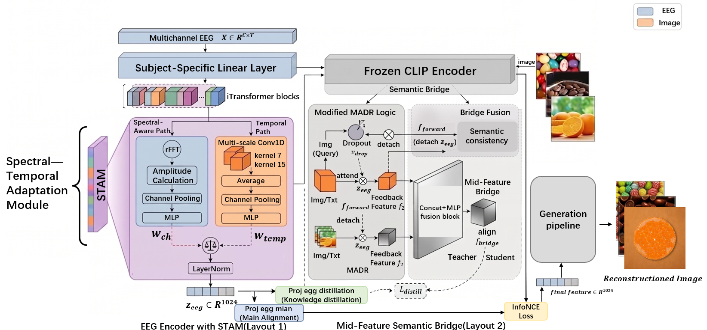

# STAMBRIDGE: Spectral-Temporal Adaptive Mid-Feature Bridge for Stable EEG Visual Decoding

<div align="center">

<p>Overall framework of our proposed STAMBRIDGE model, illustrating the Spectral-Temporal Adaptive Module (STAM) and the Mid-Feature Semantic Bridge (MFSB).</p>
</div>

## 📖 Abstract

Electroencephalography (EEG) visual decoding remains challenging due to the modality gap between low-SNR neural signals and highly structured vision-language spaces. To address this, we propose **STAMBRIDGE**, a versatile two-stage framework that sequentially tackles feature conditioning and cross-modal alignment:
1. **Spectral-Temporal Adaptive Module (STAM):** Replaces hard frequency masking with amplitude-derived soft channel weighting and multi-scale temporal convolutions, explicitly preserving frequency-aware transients while avoiding time-domain ringing artifacts.
2. **Mid-Feature Semantic Bridge (MFSB):** A model-agnostic module that constructs a regularized intermediate space through directed cross-modal interactions, enabling staged distillation and more stable semantic alignment.

STAMBRIDGE achieves state-of-the-art 200-way zero-shot retrieval performance on the THINGS-EEG benchmark, with **34.50% Top-1** and **65.95% Top-5** accuracy. 


## 📂 Repository Structure

Based on the current repository, the main components are organized as follows:

* `STAMEncoder.py`: Contains the core EEG encoder integrating the Subject-Specific Linear Layer, iTransformer backbone, and the STAM module.
* `semantic_bridge_plugin.py`: Implementation of the Mid-Feature Semantic Bridge (MFSB) supporting Multi-modal Adaptive Directional Routing (MADR) and staged distillation.
* `subject_layers/`: Directory containing specific subject-level adaptation layers and baseline transformer components (`Transformer_EncDec.py`, `Embed.py`, etc.).
* `datasets.py`: Dataloader designed for the THINGS-EEG benchmark, including memory-safe feature loading.
* `train_stambridge.py`: Main training script for contrastive alignment and staged distillation.
* `get_eegfeatures.py`: Script to extract robust EEG representations after training.
* `diffusion_prior.py` / `custom_pipeline.py` / `generation.py`: Scripts handling the generative prior-based qualitative visual reconstruction via latent diffusion.
* `loss.py`: Implementation of the InfoNCE and CLIP loss functions.
* `util.py` / `debug_util.py`: Utility functions for logging (e.g., Weights & Biases) and debugging.

## ⚙️ Environment Setup

We recommend using a dedicated Python environment.

### 1. Create a conda environment
```bash
conda create -n stambridge python=3.10 -y
conda activate stambridge
```
### 2. Install PyTorch
Please install a CUDA-compatible PyTorch version according to your local system.
For example, with CUDA 12.1:
```bash
pip install torch==2.4.1 torchvision==0.19.1 torchaudio==2.4.1
```
### 3. Install the remaining dependencies
```bash
pip install -r requirements.txt
```
## 📥 Data Availability

The experiments in this project are conducted on the **THINGS-EEG** benchmark.

- The THINGS-EEG dataset can be downloaded from:  
  https://osf.io/

- The raw and preprocessed EEG recordings, as well as the corresponding training and test images, are available from:  
  *A large and rich EEG dataset for modeling human visual object recognition*.

Please organize the dataset according to your local directory structure before training and evaluation.
## 🧠 EEG Preprocessing

To reproduce the preprocessing procedure used in our experiments, first modify the dataset paths in the preprocessing script, then run:

```bash
python EEG-preprocessing/preprocessing.py
```
## 🚀 Usage

The complete workflow of STAMBRIDGE consists of two stages:

1. **Training and retrieval evaluation**
2. **Diffusion-based image reconstruction**

---

### 1. Training and Zero-Shot Retrieval

Train STAMBRIDGE with:

```bash
python train_stambridge.py
```
This step will:
train the EEG encoder and semantic bridge
save the trained model checkpoints
evaluate 200-way zero-shot image retrieval performance
report Top-1 and Top-5 retrieval accuracy
### 2. EEG Feature Extraction for Generation
To generate reconstructed images, first extract EEG semantic features using the trained model:
```bash
python get_eegfeatures.py
```
This step converts EEG signals into aligned semantic embeddings that can be used by the diffusion-based generation pipeline.
The extracted EEG features will be saved for downstream generation.
### 3. Diffusion-Based Image Reconstruction
After EEG features are extracted, run:
```bash
python generation.py
```
This stage performs qualitative image reconstruction using:
the extracted EEG semantic embeddings
the diffusion prior
the customized generation pipeline

The generated images will be saved automatically to the output directory.
## 🙏 Acknowledgements

This project is partially built upon the open-source training framework released by:

> Li D, Wei C, Li S, et al.  
> *Visual Decoding and Reconstruction via EEG Embeddings with Guided Diffusion*.  
> arXiv:2403.07721, 2024.

We sincerely thank the authors for their valuable open-source contributions and reproducible implementation.

Our work substantially extends the original framework with:

- Spectral-Temporal Adaptive Module (STAM)
- Mid-Feature Semantic Bridge (MFSB)
- staged semantic distillation
- redesigned spectral-temporal EEG representation learning
- improved semantic alignment and reconstruction pipeline

---

## 📚 Related References

- Song Y, Liu B, Li X, et al.  
  *Decoding Natural Images from EEG for Object Recognition*.  
  arXiv:2308.13234, 2023.

- Li Y, Kang Z, Gong S, et al.  
  *Neural-MCRL: Neural Multimodal Contrastive Representation Learning for EEG-based Visual Decoding*.  
  arXiv preprint arXiv:2412.17337, 2024.

- Gifford A T, Dwivedi K, Roig G, et al.  
  *A Large and Rich EEG Dataset for Modeling Human Visual Object Recognition*.  
  NeuroImage, 2022.

- Grootswagers T, Zhou I, Robinson A K, et al.  
  *Human EEG Recordings for 1,854 Concepts Presented in Rapid Serial Visual Presentation Streams*.  
  Scientific Data, 2022.
